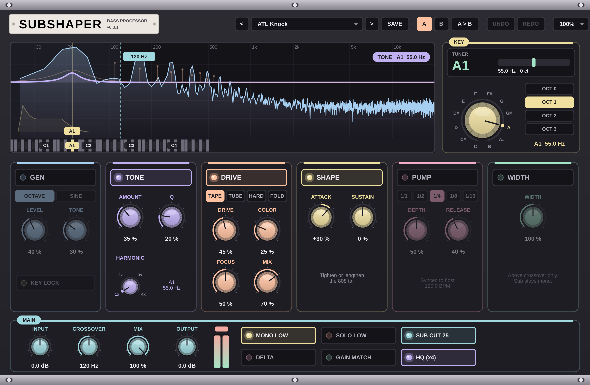

# Subshaper — v0.3.1

Plugin de traitement du grave (AU / VST3), look synthé modulaire pastel.

## Architecture
Le grave (sous la fréquence CROSSOVER) passe dans une chaîne de modules cumulables :

GEN → TONE → DRIVE → SHAPE → PUMP, puis WIDTH sur la partie aiguë.

| Module | Rôle | Réglages |
|---|---|---|
| GEN   | Crée un sub (Octave dessous ou Sine) | Level, Tone/Replace, Key Lock |
| TONE  | Résonance accordée sur la note KEY | Amount, Q, Harmonic (1x à 4x) |
| DRIVE | Saturation (Tape, Tube, Hard, Fold) | Drive, Color, Focus (note KEY), Mix |
| SHAPE | Attaque / queue du grave | Attack, Sustain |
| PUMP  | Ducking calé sur le tempo | Rate, Depth, Release |
| WIDTH | Largeur stéréo au-dessus de la coupure | Width |

KEY : potard cranté sur les 12 notes + octave (OCT 1 = zone 808).
TUNER : affiche la note jouée par la basse et l'écart en cents.
MAIN : Input, Crossover, Mix, Output, Mono Low, Solo Low, Sub Cut 25,
Delta (écoute de la différence), Gain Match, HQ (x4 / x2).
Barre du haut : presets, Save, comparaison A/B, Undo/Redo, taille de fenêtre.

## Visualisation
Survoler ou tourner un réglage affiche son action sur le spectre, dans la couleur du module :
GEN (courbe du sub), TONE (courbe de résonance), DRIVE (harmoniques générées + focus),
SHAPE (enveloppe), PUMP (cycles de ducking + niveau en direct), WIDTH (flèches de largeur),
CROSSOVER, INPUT, OUTPUT, MIX et KEY. Les automations et contrôleurs MIDI déclenchent aussi l'affichage.

## Presets (26)
Trap : ATL Knock, Crushed 808, Drill Glide, NY Drill Punch, Memphis Rumble, Rage Distorted, Plugg Soft 808, Phone Speaker Rescue
Rap & R&B : Boom Bap Warm, R&B Clean Sub, West Coast Bounce
House : Deep House Sine, Tech House Roll, Bass House Growl, Minimal Rubber, Garage Wobble Sub
Techno : Techno Rumble, Melodic Techno Sub
Afro & Latin : Afro House Round, Amapiano Log Drum, Dembow Punch
Utility : Init, Mono Fix, Sub Tighten, Kick Space, Soft Glue
Les presets ne changent jamais la note KEY.
Presets utilisateur : ~/Library/Application Support/Subshaper/Presets

## Mise à jour
1. GitHub → dossier **AocizSubShaper** → **Add file → Upload files**.
2. Glisse Source, ci, docs, CMakeLists.txt, build.sh, LISEZMOI.md → **Commit changes**.
3. **Actions** → coche verte → **Artifacts** → **Subshaper-Mac**.

## Installation (Terminal)
    sudo installer -pkg ~/Downloads/Subshaper-0.3.1.pkg -target /

Puis Ableton → Réglages → Plug-ins → Rescan ;
FL Studio → Options → Manage plugins → Find more plugins.
