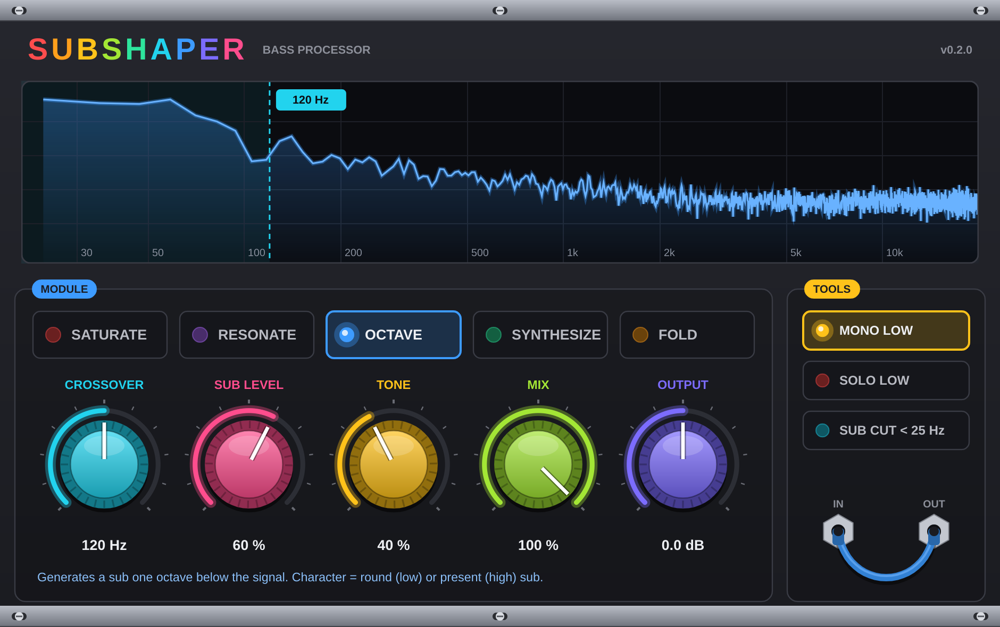

# Subshaper — v0.2.1

Plugin de traitement du grave (AU / VST3) au look synthé modulaire.
Sépare le signal en deux bandes (Linkwitz-Riley 4e ordre) et traite le grave
en suréchantillonnage x4.

## Modes
| Mode       | Amount (intensité) | Character (caractère)          |
|------------|--------------------|--------------------------------|
| Saturate   | Drive              | Asymétrie (harmoniques paires) |
| Resonate   | Resonance          | Fréquence du pic (30–200 Hz)   |
| Octave     | Sub level          | Tonalité du sub                |
| Synthesize | Sine level         | 0 = ajouté, 100 = remplace     |
| Fold       | Folds              | Asymétrie                      |

Autres réglages : Crossover (coupure), Mix (mélange), Output (sortie).
Tools : Mono Low (grave mono), Solo Low (solo grave), Sub Cut < 25 Hz.

## Mettre à jour le plugin
1. GitHub → dossier **AocizSubShaper** → **Add file → Upload files**.
2. Glisse le contenu de ce dossier → **Commit changes**.
3. Onglet **Actions** → coche verte → **Artifacts** → **Subshaper-Mac**.
4. Installe le `.pkg` (voir ci-dessous).

Pour une nouvelle version, change seulement le numéro dans `CMakeLists.txt`
(ligne `project(Subshaper VERSION x.y.z)`).

## Installer
Double-clic sur `Subshaper-x.y.z.pkg`, ou dans le Terminal :

    sudo installer -pkg ~/Downloads/Subshaper-0.2.1.pkg -target /

L'installateur supprime les anciennes versions (dont « Aociz SubShaper »).
Ensuite : Ableton → Réglages → Plug-ins → Rescan ;
FL Studio → Options → Manage plugins → Find more plugins.

## Compilation locale (optionnel)
Xcode + `brew install cmake`, puis `bash build.sh`.
