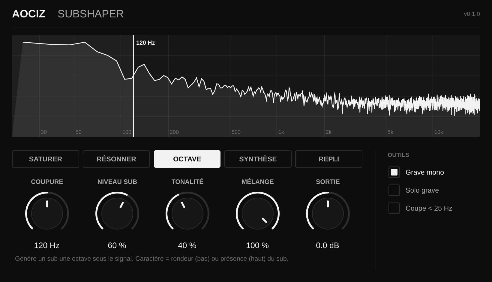

# Aociz SubShaper — v0.1.0

Plugin de traitement du grave (AU / VST3). Sépare le signal en deux bandes
(Linkwitz-Riley 4e ordre) et traite le grave en suréchantillonnage x4.

## Modes
| Mode      | Intensité     | Caractère                         |
|-----------|---------------|-----------------------------------|
| Saturer   | Drive         | Asymétrie (harmoniques paires)    |
| Résonner  | Résonance     | Fréquence du pic (30–200 Hz)      |
| Octave    | Niveau du sub | Tonalité du sub                   |
| Synthèse  | Niveau sinus  | 0 = ajouté, 100 = remplace        |
| Repli     | Nombre de replis | Asymétrie                      |

Potards communs : Coupure (40–400 Hz), Mélange, Sortie.
Outils : Grave mono, Solo grave, Coupe < 25 Hz.

## Obtenir l'AU (sans rien installer)
1. Sur github.com : **New repository** (privé si tu veux) → **uploading an existing file**.
2. Dans le Finder, appuie sur **Cmd + Maj + .** pour afficher le dossier caché `.github`,
   puis glisse **tout le contenu** de ce dossier (y compris `.github`) → **Commit changes**.
3. Onglet **Actions** : la compilation démarre (≈ 10–15 min).
4. Coche verte → ouvre l'exécution → section **Artifacts** → télécharge **Aociz-SubShaper-Mac**.
5. Dézippe (deux fois), puis **clic droit → Ouvrir** sur `INSTALLER_MAC.command`.
6. Relance Ableton (Réglages → Plug-ins → Rescan) ou FL Studio (Options → Manage plugins → Find more plugins).

## Compilation locale (optionnel)
Xcode + `brew install cmake`, puis `./build.sh` : le plugin est copié automatiquement.

## Licence JUCE
JUCE 8 : AGPLv3 ou licence commerciale (gratuite sous un certain seuil de revenus).
À vérifier sur juce.com avant toute vente du plugin.
