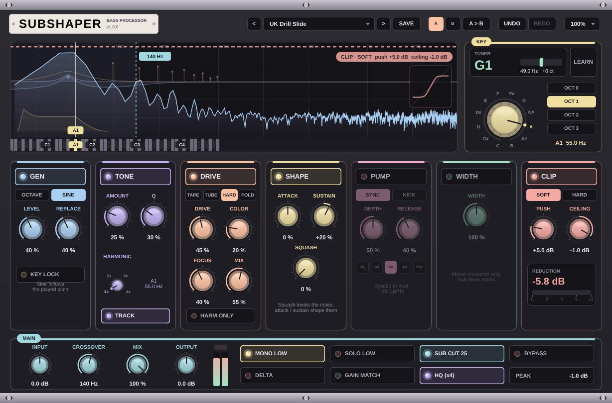

# Subshaper — v1.0.0

Plugin de traitement du grave (AU / VST3, Mac universel Intel + Apple Silicon), look synthé modulaire pastel.

## Architecture
Le signal complet est suréchantillonné (x4 en HQ, x2 sinon) : un seul étage de latence, compensé par l'hôte.
Le grave (sous la fréquence CROSSOVER) passe dans une chaîne de modules cumulables :

GEN → TONE → DRIVE → SHAPE → PUMP, WIDTH sur la partie aiguë, puis CLIP sur la sortie.

| Module | Rôle | Réglages |
|---|---|---|
| GEN   | Crée un sub (Octave dessous ou Sine) | Level, Tone/Replace, Key Lock |
| TONE  | Résonance accordée | Amount, Q, Harmonic (1x à 4x), **TRACK** (suit la note jouée) |
| DRIVE | Saturation (Tape, Tube, Hard, Fold) | Drive, Color, Focus, Mix, **HARM ONLY** (harmoniques seules, sub propre) |
| SHAPE | Niveau et enveloppe du grave | **Squash** (nivelle les notes), Attack, Sustain |
| PUMP  | Ducking du grave | **SYNC** (tempo : 1/1 à 1/16) ou **KICK** (entrée sidechain), Depth, Release |
| WIDTH | Largeur stéréo au-dessus de la coupure | Width |
| **CLIP** | Écrêteur de sortie suréchantillonné | Soft / Hard, Push, Ceiling, vumètre de réduction |

KEY : potard cranté sur les 12 notes + octave (OCT 1 = zone 808), **LEARN** (détecte la tonalité en jouant).
TUNER : note jouée par la basse et écart en cents.
MAIN : Input, Crossover, Mix, Output, Mono Low, Solo Low, Sub Cut 25, **Bypass** (compensé en latence),
Delta (écoute de la différence), Gain Match, HQ (x4 / x2), **Peak** (pic de sortie, clic = remise à zéro).
Barre du haut : presets, Save, comparaison A/B, Undo/Redo, taille de fenêtre (75 % à 150 %).

## Nouveautés v1.0 (inspirées de la concurrence)
- PUMP mode KICK : le grave s'efface quand le kick frappe (sidechain, niveau auto-normalisé) — façon Kickstart / Submerge.
- CLIP : clip de 808 façon trap, ou sécurité de sortie — façon StandardCLIP / KClip / clipper de Neutron.
- DRIVE HARM ONLY : harmoniques psychoacoustiques, la fondamentale reste intacte — façon MaxxBass / R-Bass.
- TONE TRACK : la résonance suit la note jouée — façon Bass-Mint.
- SHAPE SQUASH : toutes les notes de 808 au même niveau (compression montante + descendante).
- KEY LEARN, BYPASS, PEAK, taille 75 %, 11 nouveaux presets.
- Correction : GAIN MATCH pouvait partir en butée (x4 ou x0,25) ; il converge maintenant correctement.

## Sidechain (PUMP en mode KICK)
- Ableton : déplier le plugin (petit triangle) → Sidechain → Audio From : piste du kick.
- FL Studio : router le kick vers la piste de la basse (« Sidechain to this track »), puis dans le wrapper du plugin → Processing → entrée sidechain.
- Logic : menu Side Chain en haut de la fenêtre du plugin.

## Presets (37)
Trap : ATL Knock, Crushed 808, Drill Glide, NY Drill Punch, Memphis Rumble, Rage Distorted, Plugg Soft 808,
Phone Speaker Rescue, 808 Clip Loud, Squashed 808, Glide Tracker, UK Drill Slide
Rap & R&B : Boom Bap Warm, R&B Clean Sub, Laptop Harmonics, West Coast Bounce
House : Deep House Sine, Tech House Roll, Bass House Growl, Minimal Rubber, Kick Duck, Bass House Clip, Garage Wobble Sub
Techno : Techno Rumble, Techno Kick Duck, Melodic Techno Sub
Afro & Latin : Afro House Round, Amapiano Log Drum, Dembow Punch
Utility : Init, Mono Fix, Sub Tighten, Kick Space, Soft Glue, Leveler, Harmonics Only, Safety Clip
Les presets ne changent jamais la note KEY, l'octave, la qualité HQ ni le bypass.
Presets utilisateur : ~/Library/Application Support/Subshaper/Presets (ceux de la v0.3 restent compatibles).

## Compilation (GitHub Actions)
Chaque modification du dossier **AocizSubShaper** lance `.github/workflows/build.yml` :
compilation AU + VST3 universelle, validation `auval`, puis `.dmg` + `.pkg`
publiés dans l'onglet **Actions** (artefact Subshaper-Mac) et dans une **Release** `subshaper-vX.Y.Z`.

## Mise à jour
1. Changer le numéro dans `CMakeLists.txt` (`project(Subshaper VERSION x.y.z)`).
2. GitHub → dossier **AocizSubShaper** → **Add file → Upload files** → Commit.
3. Récupérer le `.dmg` dans **Releases** (ou Actions → Artifacts → Subshaper-Mac).

## Installation
Ouvrir le `.dmg` → double-clic sur « Installer Subshaper 1.0.0.pkg » (remplace les anciennes versions).
Ou en Terminal : `sudo installer -pkg "/Volumes/Subshaper 1.0.0/Installer Subshaper 1.0.0.pkg" -target /`

Puis Ableton → Réglages → Plug-ins → Rescan ; FL Studio → Options → Manage plugins → Find more plugins.
