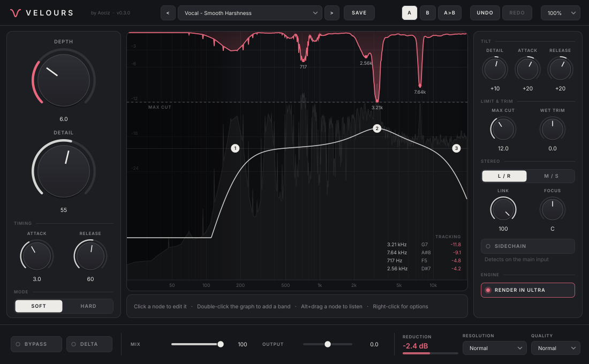

# Velours v0.1.0 — Aociz

Suppresseur de résonances dynamique AU + VST3 (macOS), inspiré de soothe3
(oeksound). Il repère en continu les fréquences qui « sonnent » trop (dureté
d'une voix, sifflantes, résonances d'une pièce, notes de basse qui ressortent)
et les atténue uniquement quand elles apparaissent.

## Les réglages

| Réglage | Rôle |
|---|---|
| **DEPTH** | Quantité de réduction (0 à 20). 5 = discret, 10 = net, 20 = très fort |
| **DETAIL** | Bas = traitement large et doux ; haut = coupes étroites et chirurgicales, uniquement sur les pics marqués (remplace Sharpness + Selectivity de soothe2, comme dans soothe3) |
| **SOFT / HARD** | Soft : suit la forme du spectre, transparent. Hard : réagit aussi aux montées soudaines, plus proche d'un compresseur |
| **DETAIL TILT** | Fait varier Detail selon la fréquence (+ = plus de détail dans les aigus) |
| **ATTACK / RELEASE** | Vitesse de réaction et de retour des coupes |
| **TIME TILT** | Fait varier attaque/relâchement selon la fréquence (+ = aigus plus rapides, graves plus lents) |
| **MAX CUT** | Plafond d'atténuation, quelle que soit la fréquence |
| **L/R – M/S, LINK** | Traitement gauche/droite ou mid/side ; Link 100 % = même traitement sur les deux canaux |
| **SIDECHAIN** | La détection se fait sur l'entrée sidechain |
| **MIX, WET TRIM, OUTPUT** | Dosage sec/traité (aligné en phase), gain du traité seul, gain de sortie |
| **DELTA** | N'écouter que ce qui est retiré |
| **Résolution** | Low Latency (21 ms), Normal (43 ms), High Res (85 ms, résolution la plus fine) — latence compensée par le DAW |

## Éditeur de bandes (écran central)

La courbe jaune règle la **sensibilité** du traitement selon la fréquence (ce
n'est pas un égaliseur). Par défaut : coupe-bas, une cloche, coupe-haut.
Jusqu'à 8 bandes : cloche, shelf grave/aigu, coupe-bas/haut, passe-bande, tilt.

- **double-clic** dans le vide : ajouter une bande ;
- **glisser** une bande : fréquence + sensibilité (Maj = fréquence seule) ;
- **molette** : largeur (Q) ;
- **clic droit** : type, **Focus** stéréo (All / Left / Right / Mid / Side), supprimer ;
- **double-clic** sur une bande : la retirer.

Les zones grisées ne sont pas traitées. En M/S ou L/R, si des bandes ont un
Focus différent, la courbe du 2e canal apparaît en pointillés.

## Écran

Gris = spectre d'entrée, bleu = sortie, rose (en haut) = réduction en cours
par fréquence, jaune = sensibilité.

## Vérifications avant envoi

Banc d'essai hors DAW (vrais fichiers source, JUCE 8.0.9) :
- depth 0 : reconstruction parfaite (erreur < 5e-7) à 44,1 / 48 / 96 / 192 kHz,
  latence mesurée = latence annoncée dans les 3 résolutions ;
- bruit blanc seul : moins de 1 dB de baisse (rien à corriger) ;
- résonance étroite à 3 kHz : -5,6 dB à depth 5, -11,7 à depth 10, -23 à depth 20 ;
- voix synthétique (harmoniques) : la résonance est coupée, les harmoniques
  normales restent intactes (-0,1 à -0,5 dB) ;
- Max Cut respecté au dixième de dB ; Delta + traité = signal sec exact ;
  bypass et mix 0 % alignés sur la latence ;
- sidechain, mono, M/S, blocs de taille aléatoire, silence, impulsions : aucune
  valeur invalide ;
- pluginval niveau 10 : réussi ; CPU ~2 à 9 % d'un cœur selon la résolution.

## Historique

**v0.1.0** — première version : moteur STFT, Depth / Detail / Soft-Hard /
Attack / Release / Max Cut / Tilt (détail et temps), éditeur de 8 bandes avec
Focus stéréo, L/R – M/S + Link, sidechain, Delta, Mix, Wet Trim, 3 résolutions,
16 presets.
